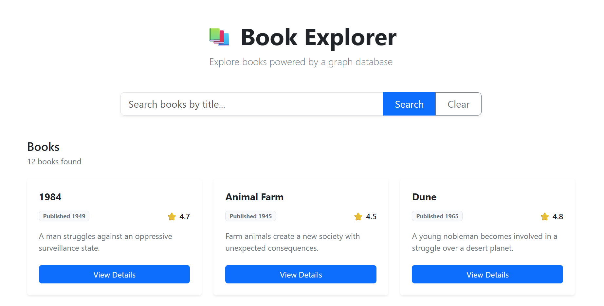
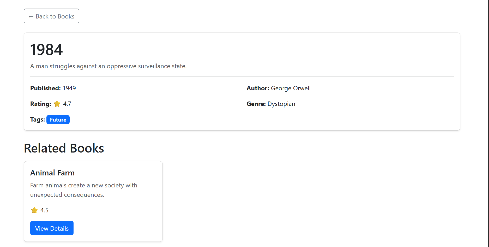
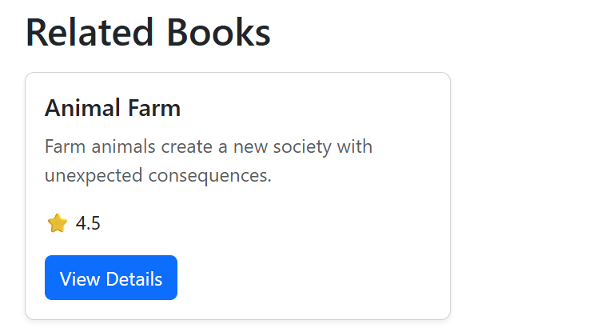
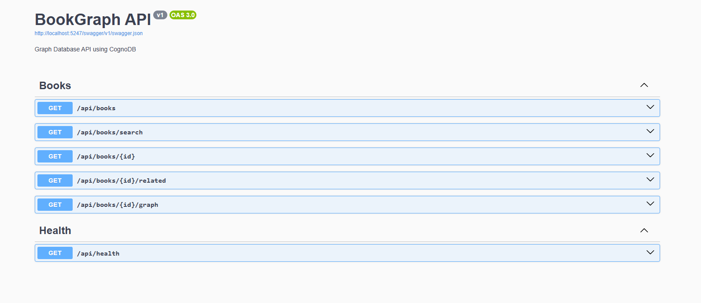

# 📚 Book Explorer — Graph Database Application

A full-stack **Graph Database Application** built using **Angular**, **ASP.NET Core Web API**, and **CognoDB**.

The application allows users to browse books, search books by title, view detailed book information, discover related books using graph relationships, and perform multi-hop graph exploration.

---

## 🚀 Features

- 📚 View all books
- 🔎 Search books by title
- 📖 View detailed book information
- ✍️ View book author
- 📂 View book genre
- 🏷️ View book tags
- 🔗 Find related books using graph relationships
- 🌐 Multi-hop graph exploration
- ⭐ Book ratings
- ⚡ RESTful ASP.NET Core Web API
- 📑 Swagger API documentation
- ❤️ Health check endpoint
- 🎨 Simple and responsive Angular UI
- 📱 Bootstrap-based UI
- ☁️ CognoDB graph database

---

## 📸 Application Screenshots

### 📚 Books Explorer

The main page displays all available books and provides title-based search.



---

### 📖 Book Details

The book details page displays the selected book's description, author, genre, rating, and tags.



---

### 🔗 Related Books

Related books are discovered using graph relationships in CognoDB.



---

### 🌐 Swagger API

The ASP.NET Core backend provides REST APIs documented through Swagger.



---

# 🏗️ Application Architecture

```text
                    ┌───────────────────────┐
                    │      Angular UI       │
                    │                       │
                    │ TypeScript            │
                    │ Bootstrap             │
                    │ Angular Router        │
                    │ HttpClient             │
                    └───────────┬───────────┘
                                │
                                │ HTTP / REST
                                ▼
                    ┌───────────────────────┐
                    │   ASP.NET Core API    │
                    │                       │
                    │ Controllers           │
                    │       ↓               │
                    │ Services              │
                    │       ↓               │
                    │ Neo4j Driver          │
                    └───────────┬───────────┘
                                │
                                │ Cypher
                                ▼
                    ┌───────────────────────┐
                    │        CognoDB        │
                    │     Graph Database    │
                    │                       │
                    │ Books                 │
                    │ Authors               │
                    │ Genres                │
                    │ Tags                  │
                    └───────────────────────┘
```

---

# 🛠️ Technology Stack

### Frontend

- Angular
- TypeScript
- HTML
- CSS
- Bootstrap
- Angular Router
- Angular HttpClient

### Backend

- ASP.NET Core Web API
- C#
- .NET
- REST API
- Swagger / OpenAPI
- Neo4j Driver

### Database

- CognoDB
- Cypher Query Language
- Graph Database

---

# 📁 Project Structure

```text
Graph_Database/
│
├── Backend/
│   └── BookGraph.Api/
│       ├── Controllers/
│       │   ├── BooksController.cs
│       │   └── HealthController.cs
│       │
│       ├── Data/
│       │   └── GraphDatabase.cs
│       │
│       ├── Models/
│       │   ├── Book.cs
│       │   ├── Author.cs
│       │   ├── Genre.cs
│       │   ├── Tag.cs
│       │   ├── BookDetails.cs
│       │   ├── GraphData.cs
│       │   ├── GraphNode.cs
│       │   └── GraphRelationship.cs
│       │
│       ├── Services/
│       │   └── BookService.cs
│       │
│       ├── Program.cs
│       └── BookGraph.Api.csproj
│
├── Database/
│   ├── seed.cypher
│   └── queries.cypher
│
├── Frontend/
│   └── BookGraph.UI/
│       ├── src/
│       │   └── app/
│       │       ├── core/
│       │       │   └── services/
│       │       │       └── book.service.ts
│       │       │
│       │       ├── models/
│       │       ├── pages/
│       │       │   ├── books/
│       │       │   └── book-details/
│       │       │
│       │       ├── app.routes.ts
│       │       └── app.config.ts
│       │
│       ├── angular.json
│       ├── package.json
│       └── tsconfig.json
│
├── screenshot/
│   ├── books-list.png
│   ├── book-details.png
│   ├── related-books.png
│   └── swagger.png
│
├── .gitignore
└── README.md
```

---

# 🗄️ Graph Database Model

The application uses a graph model where books are connected to authors, genres, and tags.

### Nodes

```text
Book
Author
Genre
Tag
```

### Relationships

```text
(Author)-[:WROTE]->(Book)

(Book)-[:BELONGS_TO]->(Genre)

(Book)-[:HAS_TAG]->(Tag)
```

Example:

```text
                ┌──────────────────┐
                │      Author      │
                │  J.R.R. Tolkien  │
                └────────┬─────────┘
                         │
                        WROTE
                         │
                         ▼
                ┌──────────────────┐
                │       Book       │
                │    The Hobbit    │
                └────────┬─────────┘
                         │
                    BELONGS_TO
                         │
                         ▼
                ┌──────────────────┐
                │      Genre       │
                │     Fantasy      │
                └──────────────────┘
```

Books can also have multiple tags:

```text
                  ┌──────────────┐
                  │     Book     │
                  └──────┬───────┘
                         │
                       HAS_TAG
                    ┌────┴────┐
                    ▼         ▼
               ┌────────┐ ┌───────────┐
               │ Magic  │ │ Adventure │
               └────────┘ └───────────┘
```

---

# 🔎 Graph-Based Related Books

A key feature of the application is finding related books using graph relationships.

For example:

```text
                 The Hobbit
                     │
                BELONGS_TO
                     │
                     ▼
                  Fantasy
                     ▲
                BELONGS_TO
                     │
        ┌────────────┼─────────────┐
        │            │             │
        ▼            ▼             ▼
 The Fellowship  The Two Towers  The Return
  of the Ring                     of the King
```

The backend uses a Cypher query to find books that share the same genre:

```cypher
MATCH (b:Book {id: $bookId})
      -[:BELONGS_TO]->(g:Genre)
      <-[:BELONGS_TO]-(related:Book)
WHERE related.id <> $bookId
RETURN related
ORDER BY related.rating DESC;
```

This demonstrates graph traversal for relationship-based book discovery.

---

# 🌐 REST API Endpoints

Base URL:

```text
http://localhost:5247
```

### Get All Books

```http
GET /api/books
```

Returns all books ordered by title.

### Search Books

```http
GET /api/books/search?search=Harry
```

Searches books by title.

### Get Book Details

```http
GET /api/books/{id}
```

Example:

```http
GET /api/books/B001
```

Returns:

- Book information
- Author
- Genre
- Tags

Example response:

```json
{
  "book": {
    "id": "B001",
    "title": "The Hobbit",
    "description": "Bilbo Baggins goes on an unexpected adventure.",
    "publishedYear": 1937,
    "rating": 4.8
  },
  "author": {
    "id": "A001",
    "name": "J.R.R. Tolkien"
  },
  "genre": {
    "id": "G001",
    "name": "Fantasy"
  },
  "tags": [
    {
      "id": "T001",
      "name": "Magic"
    },
    {
      "id": "T002",
      "name": "Adventure"
    }
  ]
}
```

### Get Related Books

```http
GET /api/books/{id}/related
```

Example:

```http
GET /api/books/B001/related
```

Returns related books based on graph relationships.

### Multi-Hop Graph Exploration

```http
GET /api/books/{id}/graph
```

Returns graph nodes and relationships discovered through multi-hop graph traversal.

### Health Check

```http
GET /api/health
```

Used to verify that the backend application is running correctly.

---

# 📊 Cypher Queries

The `Database/queries.cypher` file contains the main graph queries used by the application.

The queries cover:

1. Get all books
2. Search books
3. Get book details
4. Find related books
5. Multi-hop graph exploration

### Query 1 — Get All Books

```cypher
MATCH (b:Book)
RETURN b
ORDER BY b.title;
```

### Query 2 — Search Books

```cypher
MATCH (b:Book)
WHERE toLower(b.title) CONTAINS toLower($search)
RETURN b
ORDER BY b.title;
```

### Query 3 — Book Details

```cypher
MATCH (b:Book {id: $bookId})
OPTIONAL MATCH (a:Author)-[:WROTE]->(b)
OPTIONAL MATCH (b)-[:BELONGS_TO]->(g:Genre)
OPTIONAL MATCH (b)-[:HAS_TAG]->(t:Tag)
RETURN b, a, g, collect(t) AS tags;
```

### Query 4 — Related Books

```cypher
MATCH (b:Book {id: $bookId})
      -[:BELONGS_TO]->(g:Genre)
      <-[:BELONGS_TO]-(related:Book)
WHERE related.id <> $bookId
RETURN related
ORDER BY related.rating DESC;
```

### Query 5 — Multi-Hop Graph Exploration

```cypher
MATCH path =
    (b:Book {id: $bookId})
    -[:BELONGS_TO]->(g:Genre)
    <-[:BELONGS_TO]-(related:Book)
    <-[:WROTE]-(author:Author)
RETURN path;
```

---

# ⚙️ Setup Instructions

## Prerequisites

Make sure the following are installed:

- .NET SDK
- Node.js
- Angular CLI
- Git
- CognoDB account/database

---

## 1. Clone the Repository

```bash
git clone <YOUR_GITHUB_REPOSITORY_URL>
```

Navigate into the project:

```bash
cd Graph_Database
```

---

## 2. Configure CognoDB

Create/configure your CognoDB graph database.

Configure the backend with your CognoDB connection details.

**Do not commit database passwords, API keys, or other credentials to GitHub.**

---

## 3. Run the Backend

Navigate to the backend:

```bash
cd Backend/BookGraph.Api
```

Restore dependencies:

```bash
dotnet restore
```

Run the API:

```bash
dotnet run
```

The backend will run at:

```text
http://localhost:5247
```

Swagger will be available at:

```text
http://localhost:5247/swagger
```

---

## 4. Run the Frontend

Open another terminal.

Navigate to the Angular project:

```bash
cd Frontend/BookGraph.UI
```

Install dependencies:

```bash
npm install
```

Run Angular:

```bash
ng serve
```

The frontend will be available at:

```text
http://localhost:4200
```

---

# 🔄 Application Flow

```text
User
 │
 ▼
Angular UI
 │
 │ HTTP Request
 ▼
BooksController
 │
 ▼
BookService
 │
 ▼
Neo4j Driver
 │
 │ Cypher Query
 ▼
CognoDB
 │
 │ Graph Result
 ▼
BookService
 │
 ▼
ASP.NET Core API
 │
 │ JSON Response
 ▼
Angular UI
```

---

# 🧪 API Testing

Swagger can be used to test the backend APIs.

Open:

```text
http://localhost:5247/swagger
```

Available endpoints include:

```text
GET /api/books
GET /api/books/search
GET /api/books/{id}
GET /api/books/{id}/related
GET /api/books/{id}/graph
GET /api/health
```

---

# 🎯 Graph Database Concepts Demonstrated

This project demonstrates practical usage of:

- Graph nodes
- Graph relationships
- Node labels
- Node properties
- Relationship traversal
- One-hop traversal
- Multi-hop traversal
- Cypher queries
- Parameterized Cypher queries
- Graph-based recommendations
- REST API integration with a graph database
- Graph data transformation into API responses

---

# 💡 Why Use a Graph Database?

A graph database is useful when relationships between entities are an important part of the application.

In this project, books are connected through:

```text
Book → Author
Book → Genre
Book → Tags
Book → Genre → Related Books
```

For example, finding books related to a selected book can be performed by traversing:

```text
Book
  ↓
Genre
  ↓
Other Books
```

This allows relationship-based discovery using graph traversal instead of relying on multiple relational joins.

---

# 📌 Project Status

| Feature | Status |
|---|---|
| CognoDB Setup | ✅ Complete |
| Graph Data | ✅ Complete |
| Cypher Seed Data | ✅ Complete |
| Cypher Queries | ✅ Complete |
| ASP.NET Core Backend | ✅ Complete |
| REST APIs | ✅ Complete |
| Swagger | ✅ Complete |
| Health Check | ✅ Complete |
| Angular Frontend | ✅ Complete |
| Bootstrap UI | ✅ Complete |
| Book Search | ✅ Complete |
| Book Details | ✅ Complete |
| Related Books | ✅ Complete |
| Multi-Hop Graph Query | ✅ Complete |

---

# 🔐 Security Note

Database credentials and secrets should not be committed to the repository.

Use environment variables or local configuration for sensitive information.

Sensitive values include:

```text
Database URI
Database Username
Database Password
API Keys
```

These values should be excluded from Git using `.gitignore`.

---

# 👨‍💻 Author

## Tapan Ray

Full-Stack Software Engineer

### Technologies

```text
Angular
ASP.NET Core
C#
TypeScript
Bootstrap
CognoDB
Cypher
REST API
Swagger
Graph Database
```

---

# ⭐ Project Summary

**Book Explorer** demonstrates how a graph database can be integrated into a modern full-stack application.

The project combines:

```text
Angular
   +
ASP.NET Core
   +
CognoDB
   +
Cypher
   +
Graph Relationships
```

to provide a simple book discovery application with graph-based related-book recommendations and multi-hop graph traversal.
